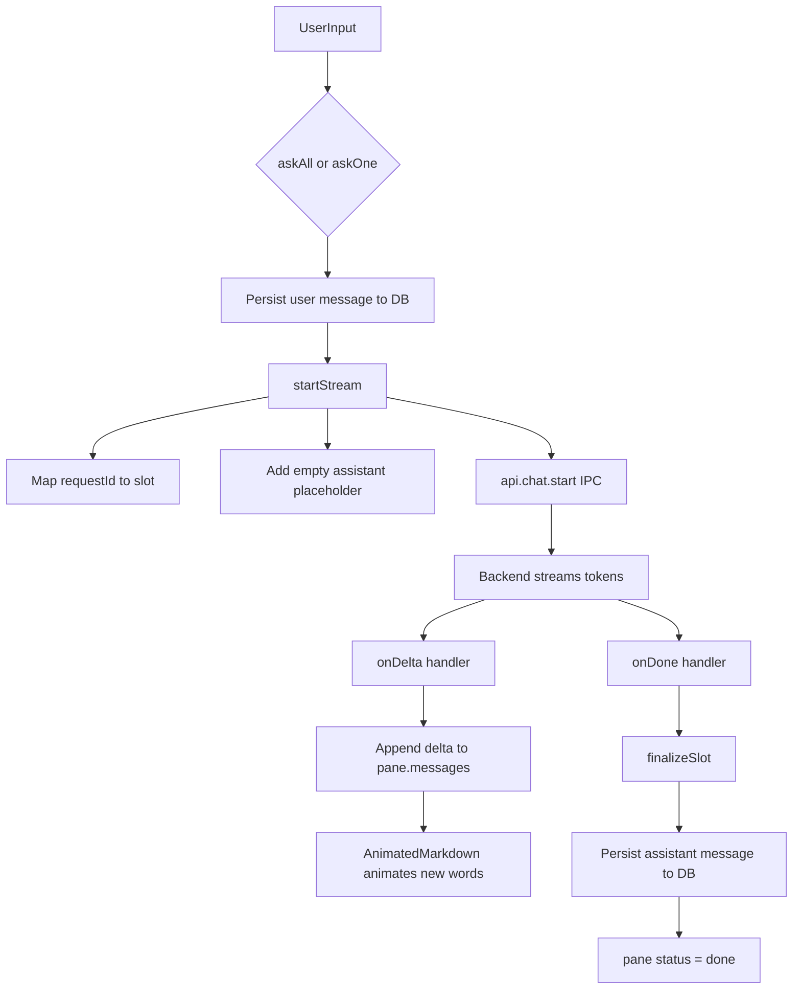

# Streaming pipeline

How a user message travels from the composer to a persisted assistant reply in `useChat`.

Source: [`src/hooks/useChat.ts`](../../src/hooks/useChat.ts)  
Presentation: [`src/components/MessageBubble.tsx`](../../src/components/MessageBubble.tsx)

## Flow diagram

## Stages

| Stage | Function / component | What happens |
| --- | --- | --- |
| 1. Send | `askAll` / `askOne` | User text is saved to the DB, appended to the pane, and passed to `startStream`. |
| 2. Start | `startStream` | Prior request on the slot is aborted; a new `requestId` is mapped to the slot; an empty assistant message is added; `api.chat.start` fires. |
| 3. Delta | `onDelta` | Each token is appended directly to the last assistant message in `pane.messages`. React 19 automatic batching keeps re-renders at ~60fps. |
| 4. Animate | `AnimatedMarkdown` in `MessageBubble` | flowtoken handles per-word streaming reveal only (`fadeIn`). All visual styling is our `markdownStyleOverrides` passed as `customComponents`. Same renderer before and after the stream; `animation` is null once done. |
| 5. Done | `onDone` | Routing maps are cleared and `finalizeSlot` is called immediately. |
| 6. Finalize | `finalizeSlot` | Full assistant text is persisted to the DB; pane status becomes `done`; sidebar refreshes. |

## Edge cases

### Abort mid-stream

All streaming panes have an active request in `activeReqBySlot`. `rollbackPane` aborts the request, removes the user + assistant messages from the UI and DB, and resets the pane to `idle`. `abort` / `abortPane` return the last sent text so the composer can restore it for editing.

### Error during stream

`onError` removes the empty assistant placeholder if present and sets `status: 'error'` with the error message on the pane.

## What changed from the previous pipeline

The custom smooth-reveal buffer layer (`pendingBySlot`, `doneInfoBySlot`, `revealFrame`, `revealTick`, `ensureRevealing`, `flushSlot`) has been removed from `useChat.ts`. Deltas now go directly into `pane.messages`. `AnimatedMarkdown` in `MessageBubble.tsx` handles rendering and streaming animation with a single shared component style map.
